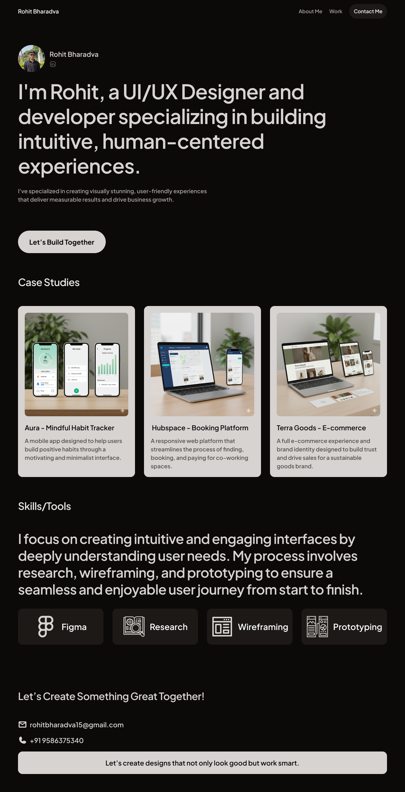

# 🌐 Rohit B. — UI/UX Designer Portfolio

A modern, responsive, and professional developer portfolio to showcase my skills, experience, and featured projects — designed with clean UI, smooth UX, and performance in mind.

---

## 📌 Overview

This is my personal portfolio website built to highlight my web development journey. It includes a hero intro, featured projects, a skills section, and a contact footer — all crafted with elegant design and subtle interactions.

---

## 🧩 Tech Stack

- Figma
- Wireframing
- Prototyping
- HTML5
- CSS3 (Sass/SCSS)
- JavaScript (ES6+)
- Git & GitHub
- VS Code

---

## 💡 Key Highlights

- Responsive design for all screen sizes
- Dark theme with modern UI/UX
- Smooth scroll and hover interactions
- Easy to navigate and fast-loading
- Custom 3D illustration for personal branding
- Structured code with clean layout

---
